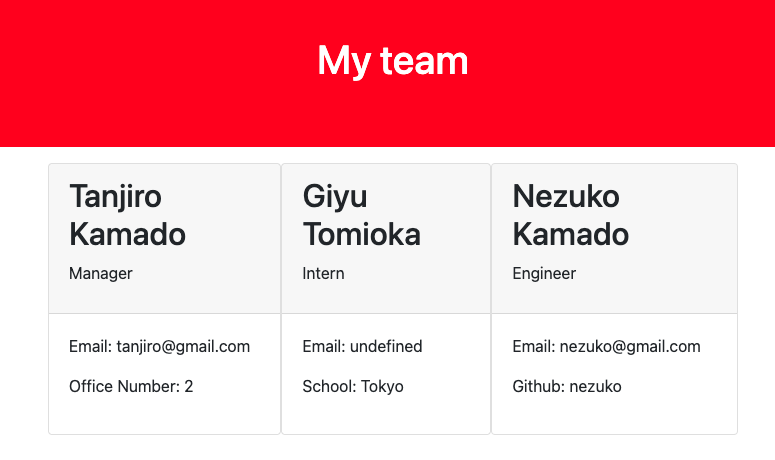

# Team-Profile-Generator

## Github URL 

<a href="https://github.com/fumixer/Team-Profile-Generator">Github:fumixer</a>

## Workthrough video

<a href="https://drive.google.com/file/d/1WqbWy9K-L9NVKBiVESTCVmb1GVOUAC2Q/view?usp=sharing">Workthrough video</a>

## Description
Using node.js, this applicatio can generate HTML file and user can make team profile by answering questions on command.

## Test
There are 4 test suites and 23 tests to pass. Put "npm run test" to try.

## Screenshots

## Tecnologies
* node.js
* npm
* inquire
* jest

